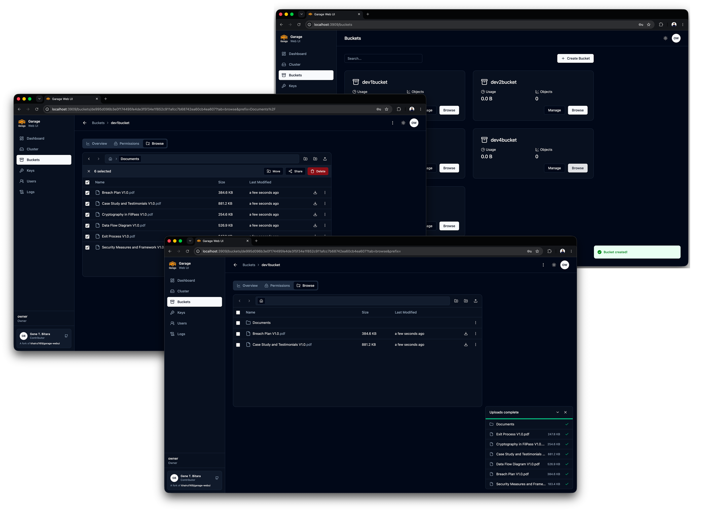
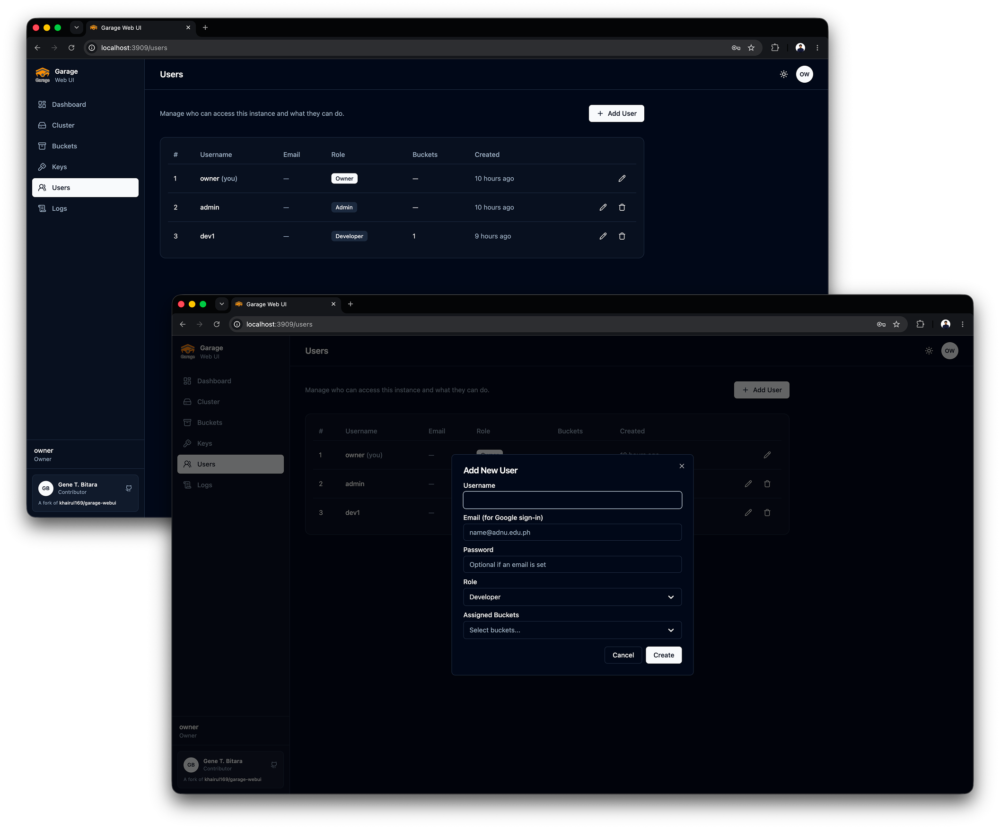

# Garage Web UI Screenshots

### Login & Dashboard

Password login with an optional **Sign in with Google** button, and the cluster health
dashboard. Both light and dark mode are supported.

### Cluster & Access Keys

Node details, layout, and status for the Garage cluster, plus S3 access key management.

### Buckets & Object Management

Bucket overview, and the object browser with multi-select bulk actions (move, share, delete)
supporting nested destination folders, plus the background upload progress panel for
drag-and-drop uploads.

### User Management

Owner/admin/developer roles, per-developer bucket assignment, and linking an account to Google
sign-in by email.

### Audit Logs

Searchable, level-filtered audit trail of logins, user management, and object actions, with
expandable rows showing IP address, user agent, and other request context.

